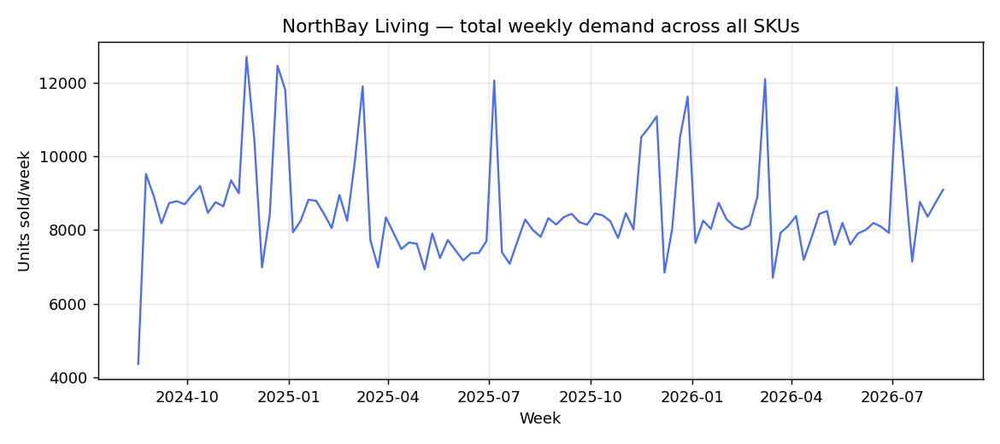
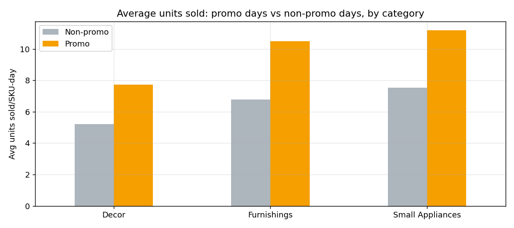
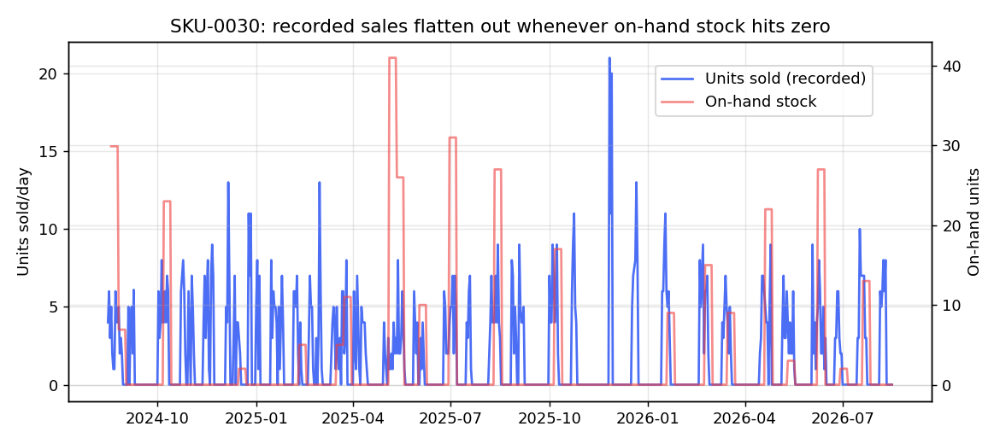

# Data-Quality & EDA Insight Memo — Project FORESIGHT

**To:** Head of Operations, Merchandiser, Finance Lead — NorthBay Living
**From:** Data Science & Analytics, Zidio Development
**Deliverable:** D2 (see full analysis and code in `notebooks/01_eda.ipynb`)

This memo summarises what we found in NorthBay's sales, inventory, calendar and product
data before any forecasting work began — what was wrong with the raw extracts, what it
took to fix, and what the clean data tells us about demand and stock. Every number here
is reproducible by re-running `python3 src/pipeline.py` followed by the EDA notebook.

---

## 1. Data quality — what we found and how we handled it

The four raw extracts (`sales_daily`, `sku_master`, `calendar`, `inventory_snapshots`)
arrived with the kind of imperfections any real export from a warehouse/e-commerce stack
tends to have. Nothing was edited by hand — every fix below is a coded, documented rule in
`src/pipeline.py`, so the same cleaning happens the same way every time the pipeline runs.

| Issue found | Where | Scale | How it was handled |
|---|---|---|---|
| Inconsistent category labels (`"FURNISHINGS"`, `" Furnishings "`, `"furnishings"`) | `sku_master` | ~10% of SKU rows | Normalised to a canonical `{Furnishings, Decor, Small Appliances}` vocabulary |
| Duplicated SKU master row with a conflicting unit cost | `sku_master` | 1 SKU | Kept first occurrence, logged the conflict for client confirmation rather than guessing |
| Exact duplicate rows | `sales_daily` | 400 rows | Dropped, keeping first occurrence |
| Exact / key duplicate rows | `inventory_snapshots` | 15 rows | Dropped, keeping first occurrence |
| Negative `units_sold` (data-entry errors) | `sales_daily` | 29 rows | Clipped to 0, flagged in a `units_sold_corrected_negative` column |
| Missing `units_sold` | `sales_daily` | 667 rows (0.5%) | Imputed from each SKU's own 7-day centred rolling median (local behaviour, not a global average) |
| Missing `unit_price` | `sales_daily` | 1,335 rows (1.0%) | Imputed from `sku_master.list_price`, discounted if that day was a promo day |
| Mixed date formats (ISO and US `MM/DD/YYYY`) | `sales_daily` | ~40 rows | Parsed explicitly against both formats rather than relying on automatic inference |
| Missing `lead_time_days` | `inventory_snapshots` | 949 rows (5%) | Imputed from the SKU's own median lead time; category median as a fallback for SKUs with none observed |
| Stray whitespace in `sku_id` | `sales_daily` | ~25 rows | Stripped before joining |

Full machine-readable log: `reports/data_quality_log.json` / `.md` (regenerated on every pipeline run).

**One data-quality issue worth flagging explicitly, not just fixing:** for 619 of the
133,500 rows in the unified dataset, no inventory snapshot yet existed on that date for
that SKU (mostly early history, before the first weekly stock count). Those rows carry no
stock position — they were left as missing rather than backfilled with an invented number.

---

## 2. Demand patterns

**Distribution is long-tailed.** The top 10 SKUs (of 200) account for **26.2%** of all
units sold over the two-year history — a small set of true best-sellers carries a
disproportionate share of volume, while a long tail of SKUs barely moves.

**Dead stock is real and roughly the same size as the best-seller group.** The bottom
decile — **20 SKUs** — each sold under **685 units total across two years** (under 1
unit/day on average). These are markdown/clearance candidates, not slow-but-healthy
sellers.

**A clear weekly and seasonal rhythm exists.** Weekend demand runs **+19.0%** above
weekday demand on average. Category-specific seasonality is strong and directionally
sensible — e.g. Air Purifiers peak in November (avg 12.9 units/SKU-day) and trough in
September (8.0); Heaters peak in November and trough in May, the pattern a home-goods
retailer would expect. This is why the forecasting baseline in Section 3 of the
methodology is a **seasonal**-naive model, not a flat one — a flat baseline would be an
unfairly easy bar to beat.

---

## 3. Promotion effect

Promotions lift demand by **+50.7%** on average (9.50 units/SKU-day on promo days vs 6.30
on non-promo days), and the effect holds up category by category.

Promotions are not spread evenly through the year — they cluster around a handful of
calendar windows (Diwali sale, year-end clearance, spring sale, monsoon sale). Because
this is a real, learnable pattern rather than noise, the forecast model is given explicit
`is_promo` / `has_promo_event` features rather than being left to guess at these spikes
from raw history alone.

---

## 4. Outlier detection

We ran both an IQR check (`Q1 - 1.5×IQR`, `Q3 + 1.5×IQR`) and a Z-score check
(`|z| > 3`) on daily `units_sold`. IQR flags **6.82%** of rows, Z-score flags **2.20%**.

Critically, **23.5%** of IQR-flagged "outlier" rows fall on a promo day — well above the
promo day's overall share of the data (~15%) — and holidays account for a further 1.7%.
That confirms most statistical outliers are genuine, explainable demand spikes, not data
errors. **We did not remove or cap these values** — doing so would strip the exact signal
(promotion response) the forecast needs to learn. They are retained and explained through
features instead.

---

## 5. Stockout evidence — demand is being under-counted, not just "low"

This is the most operationally important finding in the data. When a SKU's on-hand stock
hits zero, recorded `units_sold` reflects what could physically be shipped that day, not
what customers actually wanted — the sales figure is being **censored** by the stockout
itself.

- **82 SKUs** spent more than 10% of all days at zero on-hand stock.
- **43 SKUs** spent more than 25% of days at zero — a chronic pattern, not an occasional
  blip.

The chart above is a real SKU from the data: recorded sales flatten out to near-zero
exactly when on-hand stock (red line) hits zero, then jump back up once stock is
replenished. A model trained naively on this history alone would read the stockout period
as "demand fell," when the truth is closer to the opposite — this is precisely why risk
scoring (D4) treats forecast demand and current stock position as two separate signals
rather than assuming sales history alone tells the full demand story.

---

## 6. Business insights — plain language, four findings that should change what happens next

1. **Roughly a fifth of the catalog (43 SKUs) is chronically under-stocked**, spending
   over a quarter of the year at zero on-hand stock. Because sales are censored during
   stockouts, the demand for these SKUs is likely *higher* than the raw sales history
   suggests — ops may be reordering against numbers that are already too low, which can
   make the problem worse each cycle rather than better.

2. **A comparably sized group (20 SKUs) looks like dead stock** — minimal sales across two
   full years while presumably still tying up shelf space and capital. Left alone, this is
   exactly the pattern the brief describes: cash locked in stock that eventually gets
   marked down at a loss rather than cleared proactively.

3. **At the most recent snapshot, an estimated ₹5.5 crore (₹54.96 million) of capital is
   sitting in on-hand inventory** across the catalog (valued at unit cost). Even a modest
   reallocation away from the dead-stock group would free meaningful working capital —
   this is the rupee-impact framing Finance asked for, developed further in the risk
   scoring deliverable (D4) and the executive readout (D7).

4. **Demand has a real, learnable rhythm** — a +19% weekend effect, category-specific
   seasonal peaks, and a +50.7% promotion lift concentrated in a handful of calendar
   windows. A forecast that ignores these (or a naive flat baseline) would systematically
   mistime reorders around exactly the periods that matter most; the seasonal-naive
   baseline and the feature set built for the demand model (D3) are both designed around
   respecting this rhythm rather than smoothing over it.

---

*Full code, all charts, and re-runnable analysis: `notebooks/01_eda.ipynb`. Data-quality
log regenerated automatically on every pipeline run: `reports/data_quality_log.md`.*
